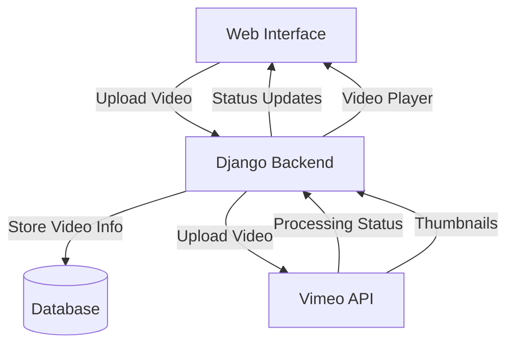
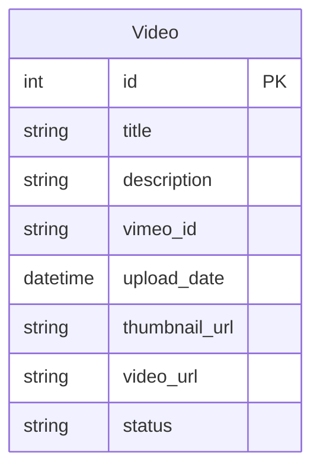
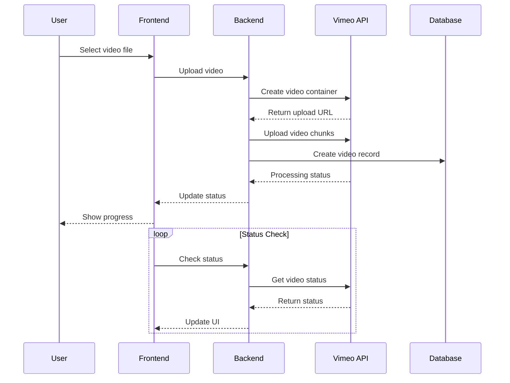

# Vimeo Integration System

A Django-based video management system that integrates with Vimeo for video hosting and processing. The system provides a user-friendly interface for uploading, managing, and viewing videos with real-time processing status updates.

## System Architecture



## Database Schema



## API Endpoints

### Video Management
- `GET /` - Video dashboard
- `GET /upload/` - Upload form
- `POST /upload/` - Handle video upload
- `GET /video/<id>/` - Video player page
- `POST /delete-video/<id>/` - Delete video
- `GET /check-video-status/<vimeo_id>/` - Check processing status
- `GET /check-progress/<vimeo_id>/` - Check upload progress

## Setup Instructions

1. Clone the repository:
```bash
git clone <repository-url>
cd vimeo-integration
```

2. Create a virtual environment and activate it:
```bash
python -m venv venv
source venv/bin/activate  # On Windows: venv\Scripts\activate
```

3. Install dependencies:
```bash
pip install -r requirements.txt
```

4. Create a `.env` file in the project root with your Vimeo API credentials:
```env
VIMEO_ACCESS_TOKEN=your_access_token
VIMEO_CLIENT_ID=your_client_id
VIMEO_CLIENT_SECRET=your_client_secret
```

5. Run migrations:
```bash
python manage.py migrate
```

6. Start the development server:
```bash
python manage.py runserver
```

## Features

### Video Upload
- Support for large video files (up to 500MB)
- Progress tracking during upload
- Automatic thumbnail generation
- Processing status monitoring

### Video Management
- Video listing with thumbnails
- Processing status indicators
- Delete functionality
- Video player integration

### Technical Features
- CORS support for cross-origin requests (ngrok compatibility)
- Chunked file uploads
- Real-time status updates
- Error handling and validation

## System Flow



## Security Considerations

- CSRF protection for form submissions
- Secure file handling
- API key management through environment variables
- Input validation and sanitization
- Cross-origin resource sharing (CORS) configuration

## Error Handling

The system includes comprehensive error handling for:
- File size validation
- Upload failures
- Processing errors
- API communication issues
- Database operations

## Development with ngrok

To use the system with ngrok:
1. Install ngrok
2. Run: `ngrok http 8000`
3. Use the provided URL to access the system

The system includes CORS headers and CSRF exemptions to work seamlessly with ngrok tunneling.

## Contributing

1. Fork the repository
2. Create a feature branch
3. Commit your changes
4. Push to the branch
5. Create a Pull Request

## License

This project is licensed under the MIT License - see the LICENSE file for details.

## Acknowledgments

- Vimeo API for video hosting
- Django framework
- Bootstrap for UI components 